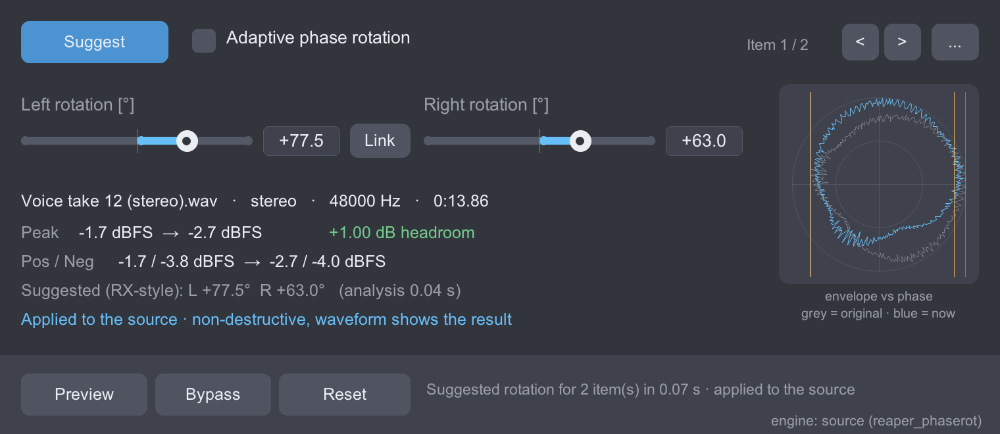

# Phase Rotation (RX-style) for REAPER

A REAPER re-creation of the **iZotope RX "Phase" module**, for media items.

Voice recordings are almost always asymmetric: the positive and negative
peaks have different heights. Rotating the phase of *all* frequencies by the
same angle does not change how the audio sounds, but it redistributes the
peaks - the waveform becomes symmetric and you gain headroom. RX does this
with a **Suggest** button, **Left/Right rotation** sliders and an **Adaptive
phase rotation** mode. This project does the same inside REAPER:

| RX Phase module            | This script                                                                 |
|----------------------------|-----------------------------------------------------------------------------|
| Suggest                    | Analyses each selected item and sets the channel-linked fixed rotation. Reproduces RX 10's own Suggest values (verified against RX renders, see `tests/RX_REFERENCE.md`); a "minimum sample peak" criterion is available too |
| Left / Right rotation [°]  | Sliders -180..+180 with a value box (click to type), Link button            |
| Adaptive phase rotation    | Re-estimates the best angle every ~43 ms and glides between values (both engines) |
| Preview / Bypass           | Plays the item from its start; Bypass switches the rotation off and on without losing the angles |
| Render                     | Not needed. With the extension the rotation is applied to the item's source: the waveform display updates immediately, nothing is written, nothing is added to the item |
| Compare                    | Not implemented - use Bypass and REAPER's undo instead                      |

## Two engines

**Source engine (recommended)** - with the `reaper_phaserot` extension installed, the
script applies the rotation to the take's *source* at runtime. Playback, rendering,
glue and the **waveform display** all show the rotated audio; no files are written,
no take FX is added, there is no latency. The project file stays a plain project:
the take still references the original `<SOURCE WAVE>` and the rotation is stored in
the take's `P_EXT:phaserot` string, which REAPER keeps in the project and in undo
states (undo/redo, copy/paste and duplicates all work). A REAPER without the extension
opens such a project normally and plays the *original, unrotated* audio - nothing goes
offline; install the extension (ReaPack, one click) to hear and see the rotation.

**Take-FX engine (fallback)** - without the extension the bundled JSFX
**"Phase Rotation (RX-style, Hilbert)"** is inserted as a take FX. Sound is processed
live, but REAPER draws item waveforms from the source, so the display does not change;
a *Render* button (new take) is offered in this mode for that purpose.

Angles use the same sign convention as RX; results match RX's Suggest (see below).



## Installation

### ReaPack (recommended)

1. Extensions → ReaPack → Import repositories…
2. Paste `https://github.com/dennech/reaper-phase-rotation/raw/main/index.xml`
3. Install **Phase Rotation (RX-style).lua** (the JSFX comes with it) and the extension
   **reaper_phaserot** (Extensions category; macOS universal, Windows x64, Linux x86_64 /
   aarch64), then restart REAPER.

### Manual

1. Copy the `Items` folder into `<REAPER resource path>/Scripts/` (rename it as you like,
   e.g. `Scripts/Phase Rotation/`). The three files must stay together:
   `Phase Rotation (RX-style).lua`, `phase_rotation_core.lua`, `phase_rotation.jsfx`.
2. Actions → Show action list → *New action…* → *Load ReaScript…* → pick the `.lua`.
3. On first run the script copies `phase_rotation.jsfx` into `Effects/Phase Rotation/`
   so that REAPER can load it.
4. Extension: put `reaper_phaserot.dylib` / `.dll` / `.so` (from the GitHub release, or
   build it - see `extension/README.md`) into `<resource path>/UserPlugins/` and restart
   REAPER. The script shows the active engine in its bottom-right corner.

Requires REAPER 6.x or newer (tested on 7.80, macOS). No extensions needed
(plain `gfx` UI, no ReaImGui / SWS / js_ReaScriptAPI).

## Usage

1. Select one or more **audio items** (mono or stereo).
2. Run the action **Script: Phase Rotation (RX-style).lua**.
3. Press **Suggest** (or `S`). Each item gets its own analysis and angle. The window shows
   the peak before/after, positive/negative peaks and the headroom you gain, plus a small
   polar plot of *envelope vs. phase* (grey = before, blue = current rotation; the
   horizontal extent of the shape is the peak level).
4. **Preview** (`Space`) / **Bypass** (`B`) to listen. Drag the sliders for manual
   adjustment (Shift = fine, mouse wheel = 1°, double-click = 0°, click the value box to
   type a number). With the source engine the waveform follows the sliders.
5. **Reset** removes the rotation from the selected items. Everything is undoable.

Multi-selection: **Suggest / Bypass / Reset / Adaptive / Link act on all selected
items**, the sliders edit the item shown in the *Item i / n* navigator.

**Adaptive phase rotation** follows the signal instead of using one fixed angle - useful
when the asymmetry changes over time (several speakers, long takes). On our speech
reference it reaches the same peak levels as RX's adaptive mode (see
`tests/RX_REFERENCE.md`). Optional smoothing in the `...` menu. Like RX, it is meant for
dialogue; on music a fixed angle is usually cleaner.

The JSFX can also be used on its own (track FX or take FX) - it has the same controls.

## How it works

* **Rotation**: `y = cos(θ)·x + sin(θ)·H{x}` (RX's sign convention), where `H` is a linear-phase FIR Hilbert
  transformer (Kaiser window, 8193 taps at ≤ 50 kHz, 16385 above), applied by FFT
  overlap-save convolution. Flat to within 0.01 dB from 14 Hz up. At 0° the output is
  bit-identical to the input. In the JSFX the latency (block + one sub-block of look-ahead
  + FIR delay, about 300 ms at 48 kHz) is reported as PDC and fully compensated by REAPER,
  so nothing shifts in time; the extension reads ahead itself and has no latency.
* **Suggest**: the analysis in Lua computes the same Hilbert transform (using REAPER's
  native FFT), builds histograms of the analytic-signal envelope over phase (0.125°
  bins) and searches the angle that minimises `Σ|y|^8` - an L8 norm, i.e. a smooth
  "peak" measure. This is what reproduces iZotope RX 10's Suggest values (+78° / +62° /
  +78° on our three reference files, ours: +77.6° / +62.3° / +77.5°; details in
  `tests/RX_REFERENCE.md`). The alternative criterion (menu `...`) minimises the exact
  sample peak `max |y|`, which gives 0.3–0.6 dB more headroom than RX's angle. A
  90-second stereo file is analysed in about 0.4 s.
* **Adaptive**: the peak-minimising angle is estimated on 43 ms sub-blocks (gating on
  silence, hysteresis between near-equal minima) and interpolated linearly between
  sub-block centres with one sub-block of look-ahead - both in the extension (computed
  once per take) and in the JSFX (with PDC).

## Notes and limitations

* Processes whole items. To treat only a region, split the item first.
* Stereo items are analysed per channel; with **Link** on, one common angle is used
  (like RX). Items with more than two channels: channels 1–2 are processed, the rest pass
  through.
* Analysis uses the part of the source the item plays (start offset, length, play rate) and the take's channel mode, but not other take FX.
* The peak criterion is a *sample* peak, as in RX. A single click can dominate it - remove
  clicks first, or set the angle by ear.
* Take-FX engine only: live playback with the JSFX adds ~300 ms of PDC latency; rendering
  is unaffected. The source engine has no latency.
* Source engine: REAPER computes the display peaks of a rotated take on demand (about
  0.3 s per 10 minutes of audio after each change).

## Tests

`tests/reference.py` is an independent numpy implementation (FIR design, angle search,
synthetic asymmetric "voice" signals). `tests/run_tests.sh` builds the extension, launches
an isolated REAPER instance (separate resource directory, nothing of your own config is
touched), runs `tests/run_in_reaper.lua` (JSFX engine: analysis, fixed-angle renders, PDC
alignment, adaptive render, track-FX bypass), `tests/ext_test.lua` (source engine: output
vs. reference, waveform peaks, undo/redo, duplicate, save/reload, bypass/reset, adaptive)
and `tests/gui_smoke.lua` (scripted clicks through the real UI), and compares the results
with the reference: suggested angles agree within 0.35° (the analysis histogram step is 0.125°), audio matches to ~1e-6. `tests/RX_REFERENCE.md` documents the comparison with iZotope RX 10
(angles, sign convention, rendered audio).

```bash
python3 -m venv .venv && .venv/bin/pip install numpy scipy
PY=.venv/bin/python ./tests/run_tests.sh /tmp/phase-rotation-tests
```

## Credits

Built by [dennech](https://github.com/dennech) together with Claude. The behaviour is
modelled on the documented semantics of iZotope RX's Phase module; no iZotope code is used.
MIT license.
